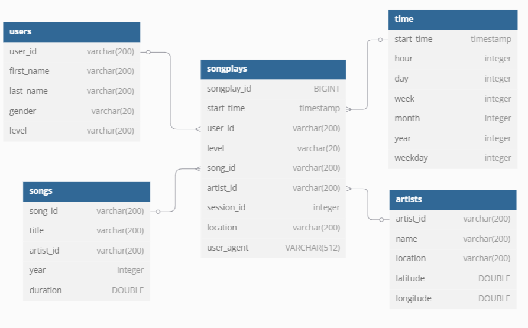
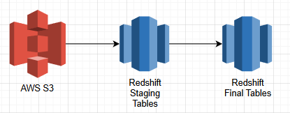
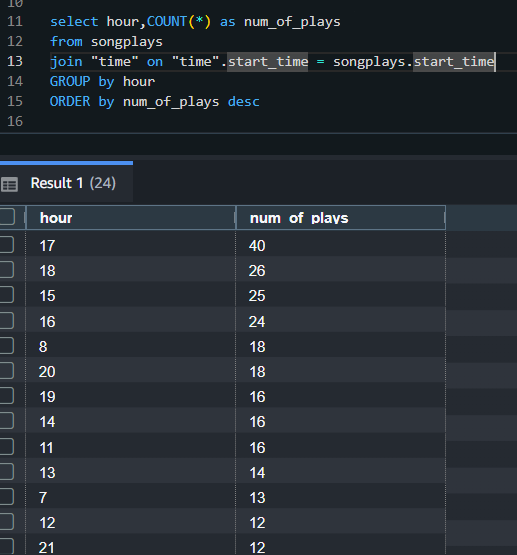

### Project Overview
Sparkify is a music streaming startup that want to move their userbase and song database onto the cloud as they scaling up, 
Their data is stored now on AWS S3 in JSON format for both user logs and songs data.

**Task**: 

Building an ETL pipeline that extract data from S3, stage them in two tables on Redshift, and transforms data then loading it into a set of dimensional tables to be used by their analytical team.

---

**Database Schema** 

Building a Star Schema DWH that is optimized for heavy analytical Queries due to its denormalization nature with the use of Fact and Dimension Tables concept.

----
**ETL Pipeline**

The ETL Pipeline starts by Copying the JSON data from S3 into Staging Tables on Redshift, then Using a select statments on these tables to transform the data as needed then load it into Final Analytical Tables. 

---

**How to Run the Code ?!**

1. Writing Redshift DB Configurations in dwh.cfg
2. writing the iam role arn for redshift to access s3 in dwh.cfg
3. Writing Needed Tables Queries for Droping,Creation,Copying and Insertion.
4. Run Create_tables.py
5. Run ETL.py
---
**Example Queries**

Here is a query that retreives the hours with most number of songs plays.

